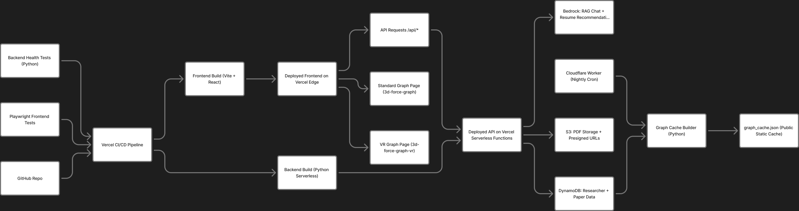

<div align="center">

<br/>

<!-- Banner Section -->
<a href="https://paper-pigeon-deployment.vercel.app/">
  
</a>

<br/>
<br/>

# ✨ Paper Pigeon ✨

<br/>

**Explore research like never before — a 3D universe of ideas takes flight.**

<br/>

[](https://paper-pigeon-deployment.vercel.app/)

<br/>

<!-- Tech Stack Badges -->
<p>
  
  
  
  
  
</p>
<p>
  
  
  
  
  
</p>
<p>
  
  
  
  
</p>

<br/>

---

</div>

<br/>

<div align="center">

## 🎬 See It In Action

<br/>


<br/>
<br/>

</div>

---

<br/>

## 🌟 Features

<br/>

<table>
<tr>
<td width="50%">

### 🔮 **Interactive 3D Graph**
Navigate a stunning force-directed graph of researchers, labs, and papers. Click, drag, zoom — make the data dance.

### 🥽 **VR Mode**
Step inside your research network. Put on a headset and walk through connections in full immersive VR.

### 📄 **Resume Semantic Matching**
Upload your resume. Our AI finds researchers whose work aligns with your experience and interests.

### 🤖 **Bedrock RAG Chat**
Ask questions about any paper. Get intelligent answers with citations, powered by AWS Bedrock's retrieval-augmented generation.

### 🔍 **Research Paper Explorer**
Dive deep into researcher profiles, publications, tags, and lab affiliations. Everything connected, everything searchable.

</td>
<td width="50%">

### ⚡ **Static Graph Cache**
Lightning-fast load times. The entire research network is pre-computed and cached as optimized JSON.

### ☁️ **Serverless Architecture**
Zero servers to maintain. Flask API runs as Vercel Serverless Functions with automatic scaling.

### 🕐 **Cloudflare Scheduled Rebuilds**
Nightly cron jobs keep the graph fresh. New papers and researchers appear automatically.

### 📎 **PDF Scanning & S3 Uploads**
Client-side PDF parsing meets secure S3 presigned URLs. Access papers instantly, securely.

### 🎨 **Modern Frontend**
Built with Vite + React 19 + TypeScript. Tailwind CSS for that crisp, responsive feel.

</td>
</tr>
</table>

<br/>

---

<br/>

<div align="center">

## 🏗️ Architecture

<br/>



<br/>

</div>

<br/>

> 💡 **Note:** This diagram is a conceptual overview of the system. The actual implementation may vary in specific details, but the overall data flow and component boundaries are accurately represented.

<br/>

### 🔄 The Pipeline

**Code → Deploy → Serve**

1. **GitHub** pushes trigger the **Vercel CI/CD Pipeline**
2. **Playwright frontend tests** and **Python backend health checks** validate the build
3. Two parallel builds run:
   - **Frontend Build** (Vite + React) → Deployed to Vercel Edge
   - **Backend Build** (Python Serverless) → Deployed as Vercel Functions
4. The deployed frontend serves two main experiences:
   - 🔮 **Standard Graph Page** — 3d-force-graph WebGL visualization
   - 🥽 **VR Graph Page** — Immersive A-Frame VR experience

**API & Data Layer**

5. All `/api/*` requests route to **Vercel Serverless Functions**
6. The API connects to three AWS services:
   - 🤖 **Bedrock** — RAG chat + resume recommendation AI
   - 📎 **S3** — PDF storage with presigned URL access
   - 📊 **DynamoDB** — Researcher, paper, and relationship data

**Cache & Scheduling**

7. **Cloudflare Workers** run a nightly cron job
8. The **Graph Cache Builder** (Python) queries DynamoDB and generates `graph_cache.json`
9. This static cache enables instant graph loads without runtime database queries

<br/>

### 📦 Key Components

| Layer | Technology | Purpose |
|-------|------------|---------|
| **CI/CD** | GitHub → Vercel | Automated deployments on every push |
| **Testing** | Playwright + Python | Frontend E2E tests & backend health checks |
| **Frontend** | Vite + React + TypeScript | Fast, modern SPA with 3D visualization |
| **Backend** | Flask on Vercel Serverless | API routes with zero cold-start overhead |
| **3D Engine** | 3d-force-graph + Three.js | WebGL-powered network visualization |
| **VR** | A-Frame + 3d-force-graph-vr | Immersive VR research exploration |
| **AI/ML** | AWS Bedrock | RAG chat & semantic resume matching |
| **Database** | DynamoDB | Researchers, papers, edges, metadata |
| **Storage** | S3 | PDF documents with presigned URL access |
| **Scheduling** | Cloudflare Workers | Nightly graph cache rebuilds |
| **Cache** | Static JSON | Pre-computed graph for instant loads |

<br/>

---

<br/>

## 🚀 Build & Development

<br/>

### Prerequisites

```bash
# Required
node >= 18.0.0
pnpm (or npm/yarn)
python >= 3.12
```

<br/>

### Quick Start

```bash
# Clone the repository
git clone https://github.com/your-org/paper-pigeon.git
cd paper-pigeon

# Install frontend dependencies
pnpm install

# Start the development server
pnpm dev
```

Frontend runs at **http://localhost:5173** 🎉

<br/>

### Backend Development

```bash
# Create and activate virtual environment
python -m venv venv
source venv/bin/activate  # Windows: venv\Scripts\activate

# Install Python dependencies
pip install -r requirements.txt

# Run Flask backend locally
python backend/app.py
```

Backend runs at **http://localhost:5000** 🐍

<br/>

### Environment Variables

Create a `.env` file or set these in your Vercel dashboard:

| Variable | Required | Description |
|----------|:--------:|-------------|
| `AWS_ACCESS_KEY_ID` | ✅ | AWS credentials |
| `AWS_SECRET_ACCESS_KEY` | ✅ | AWS credentials |
| `AWS_REGION` | ✅ | AWS region (e.g., `us-west-2`) |
| `S3_BUCKET_NAME` | ✅ | Bucket for PDF storage |
| `BEDROCK_KNOWLEDGE_BASE_ID` | ✅ | Primary KB for paper chat |
| `BEDROCK_KNOWLEDGE_BASE_ID_2` | ✅ | Secondary KB for recommendations |

<br/>

### Rebuild Graph Cache

```bash
# Rebuild from DynamoDB (requires AWS credentials)
python backend/build_graph_cache.py

# Upload to S3 (optional, for Lambda deployments)
python tools/upload_cache.py
```

<br/>

### Testing

```bash
# TypeScript type checking + build
pnpm build

# Lint
pnpm lint

# Run Playwright tests (if configured)
npx playwright test

# Backend health check
curl http://localhost:5000/health
```

<br/>

### Deploy to Vercel

```bash
# Install Vercel CLI
npm i -g vercel

# Deploy
vercel --prod
```

Or just push to your connected GitHub repo — Vercel handles the rest! 🚀

<br/>

---

<br/>

<div align="center">

## 📁 Project Structure

</div>

<br/>

```
paper-pigeon/
├── 📂 api/
│   └── index.py              # Vercel serverless entry point
│
├── 📂 backend/
│   ├── app.py                # Flask application
│   ├── graph_core.py         # Graph builder logic
│   ├── 📂 controllers/       # API route handlers
│   │   ├── rag_controller.py
│   │   ├── pdf_controller.py
│   │   └── recommendations_controller.py
│   └── 📂 services/          # AWS integrations
│       ├── bedrock_service.py
│       ├── dynamodb_service.py
│       └── s3_service.py
│
├── 📂 src/
│   ├── App.tsx               # Root component
│   ├── 📂 components/        # React components
│   │   ├── ResearchNetworkGraph.tsx   # Main 3D graph
│   │   ├── VRGraph.tsx                # VR mode
│   │   ├── SearchBar.tsx              # Search + resume upload
│   │   ├── ResearcherModal.tsx        # Profile modals
│   │   ├── PaperChatModal.tsx         # RAG chat interface
│   │   └── ...
│   └── 📂 services/          # Frontend API client
│       └── dynamodb.ts
│
├── 📂 public/
│   └── graph_cache.json      # Pre-computed graph data
│
├── vercel.json               # Vercel configuration
├── requirements.txt          # Python dependencies
└── package.json              # Node dependencies
```

<br/>

---

<br/>

<div align="center">

## 🤝 Contributing

Pull requests welcome! For major changes, please open an issue first.

<br/>

## 📜 License

MIT

<br/>
<br/>

---

<br/>

**Built with 💜 by researchers, for researchers.**

<br/>

<a href="https://paper-pigeon-deployment.vercel.app/">
  
</a>

<br/>
<br/>

</div>
